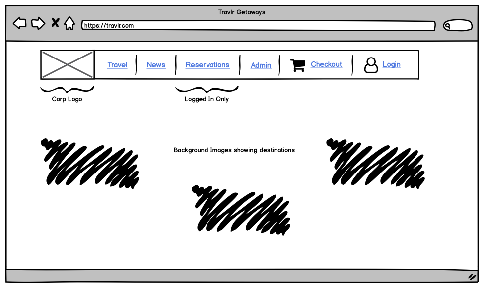

# CS 465 Project Guidelines and Rubric

## Competency

In this project, you will demonstrate your mastery of the following competencies:

- Design the architecture of a web application
- Build a web application using frameworks
- Develop and integrate a database using frameworks

## Scenario

You are a software developer working for a software development company. Your supervisor assigned you to build a travel booking website for a new client, Travlr Getaways. The marketing department at Travlr Getaways has provided the specs and a wireframe to guide the development of the website. Your role as a software developer is to produce a fully functional travel web application that meets Travlr Getaways' requirements:

"We are looking to create a travel booking site for our customers to book travel packages. Our customers must be able to create an account, search for travel packages by location and price point, and book reservations with our travel agency. Customers must also be able to visit our website regularly before their trip to see their itineraries. We are also seeking to have an admin-only site where Travlr Getaways administrators can maintain a customer base, available trip packages, and pricing for each item and package."

Begin by exploring the architecture of a full stack web application that uses the MEAN stack. MEAN stands for the essential full stack tools: MongoDB, Express, Angular, and Node.js. These tools are available to you to develop the app. First, you must map out the architectural components and set up the development environment. This step includes completing your initial setup of the Node.js server and the Express framework. Next, you will customize the customer-facing webpage to align with the wireframe provided and meet Travlr Getaways' vision.

The wireframe will be an initial reference to guide the construction of a static customer-facing website using HTML, CSS, and JavaScript. You are responsible for building the functionality of the front end and considering both client- and server-side coding. You must think ahead about the administrator interface, how you will generate request responses using traveler search criteria, and how you will collect login identification. Once completed, you will focus on the server side of the full stack application and set up the MongoDB database.

Next, you will code the backend of the application. You must create and configure a NoSQL database with data models and a schema for data files and storage. Using this database, you can store travel booking trips. You can create JSON files containing initial data for seeding the database to enable testing of the RESTful API routes. Then you will populate the database and can view the seeded collections and documents in the database. You must wire the database to the server, test the RESTful API, and refactor the code to work successfully with the front end.

Once you have completed the customer front-end development and designed the back-end architecture for building a full stack travel application, you will be ready to produce a more complex front end to support the administrative functions to manage the database.

You will then complete the last few steps of the full stack development for Travlr Getaways. You must complete the client single-page application (SPA) using Angular, add security features, and do final testing on the full stack web application. You will use the Angular command line interface (CLI) to build components and services for the client-facing front end. Angular offers many fully integrated tools to facilitate the build. Once completed, you will test the application with the API and make certain the server returns the data properly. Finally, Travlr Getaways wants you to add a layer of security that applies to server-side applications to produce web tokens for web login authentication.

## Directions

### Full Stack Web Application

Review the information your client, Travlr Getaways, provided, including the scenario and the wireframe, to outline your client's software requirements. You will use this information and the full stack guides in the Supporting Materials section to support your development of a full stack web application that meets Travlr Getaways' vision.

**Note**: You have worked on developing the full stack web application throughout the course. Additional guidance for completing each application component is outlined in detail in the module assignments and the full stack guides. Be certain to implement the feedback you receive along the way, as you will need to submit your fully functional full stack web application as part of the project submission.

Specifically, your full stack web application must demonstrate your ability to do the following actions:

- **Customer-Facing Website:** Develop and run a complex public customer-facing web application that meets software requirements.
- **MVC Routing:** The customer-facing website must be an Express web application with routes, controllers, views, and data models.
- **Static HTML to Templates With JSON**: Use the Handlebars (HBS) templating engine to move the static HTML site to templates to render JSON data dynamically within the application.
- **NoSQL Database:** Configure a NoSQL database using Mongoose to store data in the server side of the software application.
- **RESTful API:** Integrate RESTful API with a NoSQL database, which is organized using models and schemas with existing software frameworks.
- **SPA:** Use frameworks to include rich functionality and features in a SPA to meet software requirements. Use the test data provided and add other examples of tours with dates and other data to test the SPA.
- **Security:** Refactor the code to add security controls, including a login form, and apply best practices to ensure authorized access using secure endpoints.

### Software Design Document (SDD)

Throughout your full stack app development, you will present your work to the software development team for approval using a software design document. Be prepared to explain your approach as you build each component of the full stack travel application.

**Note**: You have worked on completing this document throughout the course. Additional guidance for completing each SDD section is outlined in the milestones. Be certain to implement the feedback you receive along the way, as you will need to submit your finalized SDD as part of the project submission.

Specifically, you must address the following rubric criteria:

1. **Executive Summary**
   - Describe the appropriate architecture of the web application based on your client's software requirements. Be sure to reference your use of the MEAN stack for development. Explain both the customer-facing side of the application and the administrator SPA.

2. **System Architecture View**
   - **Component Diagram:** Describe the overall system architecture of the web application by referring to the component diagram provided in the SDD. Be sure to identify the significant components that will be used and their relationships to one another.
   - **Sequence Diagram:** Illustrate the flow of logic in a web application by completing a sequence diagram. Describe the flow of logic in the web application based on the sequence diagram. Be sure to describe the interactions between the layers, or tiers, of the full stack application. It will be helpful to include significant processes such as Sign In, Trips, and Admin interactions when referring to the sequence diagram.

3. **User Interface**
   - Summarize the Angular project structure and how it compares to the Express project structure. Be sure to describe the rich functionality provided by the SPA compared to a simple web application interaction.
     - A. Describe the process of testing to make sure the SPA is working with the API to GET and PUT data in the database.

**Note**: You completed the information needed for the User Interface section of the SDD in the Module Six journal.

## What to Submit

To complete this project, you must submit the following items:

### Full Stack Web Application

Submit your final iteration of the completed full stack web application, which meets Travlr Getaways' software requirements, as a zipped file folder (travlr.zip).

### Software Design Document

Submit a completed software design document using the Software Design Document Template provided. Be certain to complete all sections and address all items in the rubric and directions.

## Supporting Materials

The following resources may help support your work on the project:

A wireframe is like a blueprint to help you think about the architecture of a web-based software application. Refer to the wireframe provided by Travlr Getaways to make certain your architecture and full stack application align with your client's expected output. A text version of the wireframe is available: [Travlr Getaways Wireframe Text Version](Travlr_Getaways_Wireframe_Text_Version.docx).

## Project Rubric

| Criteria | Exceeds Expectations | Meets Expectations | Partially Meets Expectations | Does Not Meet Expectations | Value |
|---|---|---|---|---|---|
| Executive Summary | Exceeds expectations in an exceptionally clear, insightful, sophisticated, or creative manner (100%) | Describes the appropriate architecture of a full stack web application, referencing the use of the MEAN stack (85%) | Shows progress toward meeting expectations, but with errors or omissions; areas for improvement may include missing key logical components, data storage, or technologies used (55%) | Does not attempt criterion (0%) | 5 |
| System Architecture View: Component Diagram | N/A | Describes the overall system architecture of the web application, identifying the significant components and their relationships (100%) | Shows progress toward meeting expectations, but with errors or omissions; areas for improvement may include missing key components or technologies (55%) | Does not attempt criterion (0%) | 5 |
| System Architecture View: Sequence Diagram | N/A | Illustrates the flow of logic in a web application by completing a sequence diagram (100%) | Shows progress toward meeting expectations, but with errors or omissions; areas for improvement may include missing components of client- or server-side interactions, incorrect flow of messages (55%) | Does not attempt criterion (0%) | 5 |
| Customer-Facing Website | N/A | Develops and runs a public website that meets software requirements (100%) | Shows progress toward meeting expectations, but with errors or omissions; areas for improvement may include site folders not being restructured properly or models, view, routes, or controllers not completed and functional (55%) | Does not attempt criterion (0%) | 5 |
| Render Test Data | N/A | Utilizes templating engine to render test data dynamically within the website (100%) | Shows progress toward meeting expectations, but with errors or omissions; areas for improvement may include data not being successfully read and rendered dynamically in views (55%) | Does not attempt criterion (0%) | 5 |
| NoSQL Database | Exceeds expectations in an exceptionally clear, insightful, sophisticated, or creative manner (100%) | Configures a NoSQL database by describing the metadata schema to a NoSQL database for storing data in the server side of application (85%) | Shows progress toward meeting expectations, but with errors or omissions; areas for improvement may include missing properties or incorrect data types (55%) | Does not attempt criterion (0%) | 5 |
| Database | N/A | Integrates a NoSQL database into a software application using existing frameworks (100%) | Shows progress toward meeting expectations, but with errors or omissions; areas for improvement may include trips collection with all properties and data stored correctly (55%) | Does not attempt criterion (0%) | 15 |
| API | N/A | Builds a RESTful API that retrieves data from a database (100%) | Shows progress toward meeting expectations, but with errors or omissions; areas for improvement may include routes and endpoints for list trips, add/update trip functions, and data processing (55%) | Does not attempt criterion (0%) | 15 |
| Testing | N/A | Tests the software application by using input and output to show the application is able to store and retrieve data (100%) | Shows progress toward meeting expectations, but with errors or omissions; areas for improvement may include correctly testing all requirements and use cases (positive and negative) (55%) | Does not attempt criterion (0%) | 15 |
| SPA | Exceeds expectations in an exceptionally clear, insightful, sophisticated, or creative manner (100%) | Utilizes frameworks to include rich functionality and features in a single-page application to meet software requirements (85%) | Shows progress toward meeting expectations, but with errors or omissions; areas for improvement may include not utilizing AngularJS components, services, routes, and views to build functional SPA (55%) | Does not attempt criterion (0%) | 15 |
| Security | N/A | Adds security controls including a login form and applies best practices to ensure authorized access using secure endpoints (100%) | Shows progress toward meeting expectations, but with errors or omissions; areas for improvement may include not implementing login, not securing SPA, not securing API endpoints (55%) | Does not attempt criterion (0%) | 7 |
| Clear Communication | Exceeds expectations with an intentional use of language that promotes a thorough understanding (100%) | Consistently and effectively communicates in an organized way to a specific audience (85%) | Shows progress toward meeting expectations, but communication is inconsistent or ineffective in a way that negatively impacts understanding (55%) | Shows no evidence of consistent, effective, or organized communication (0%) | 3 |
| | | | | Total: | 100% |
