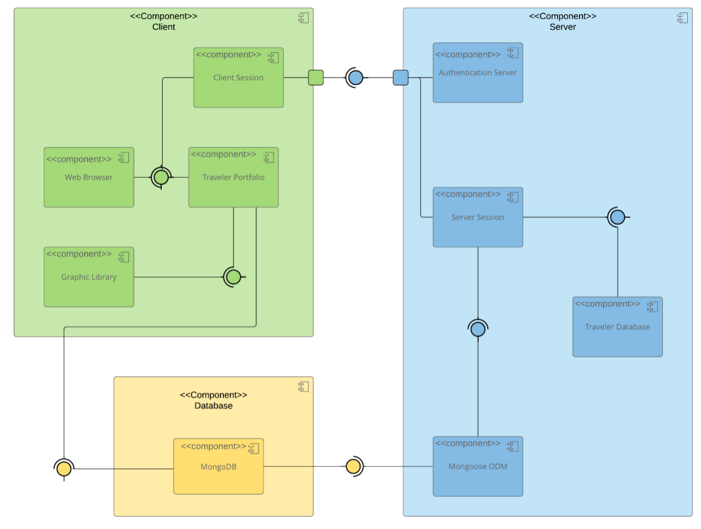
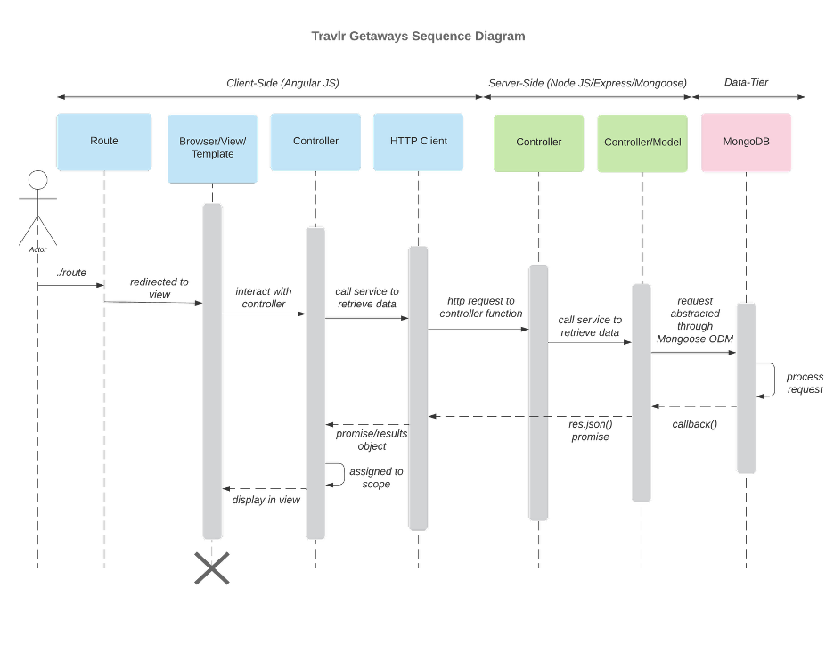
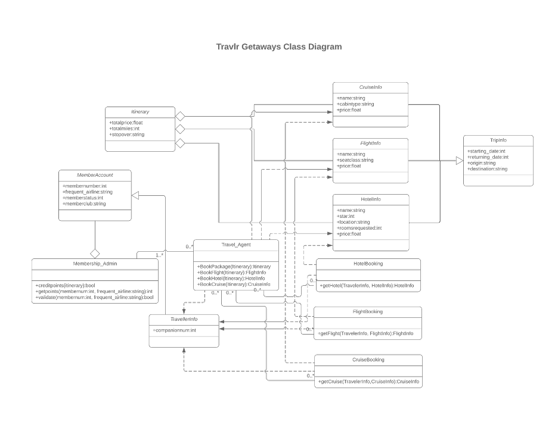
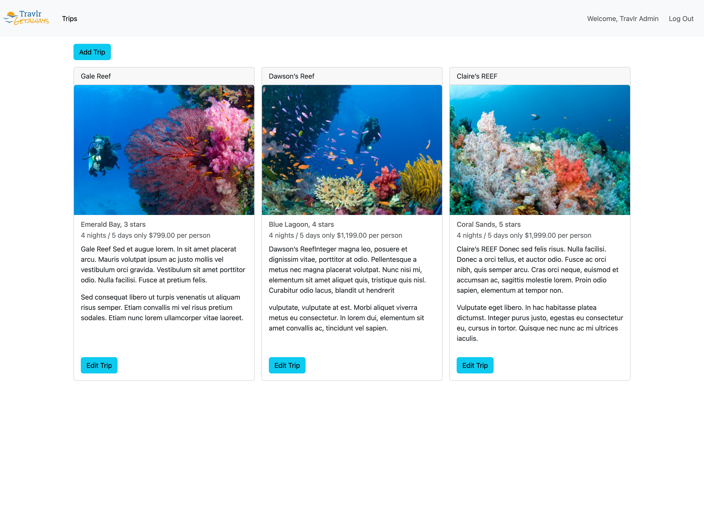
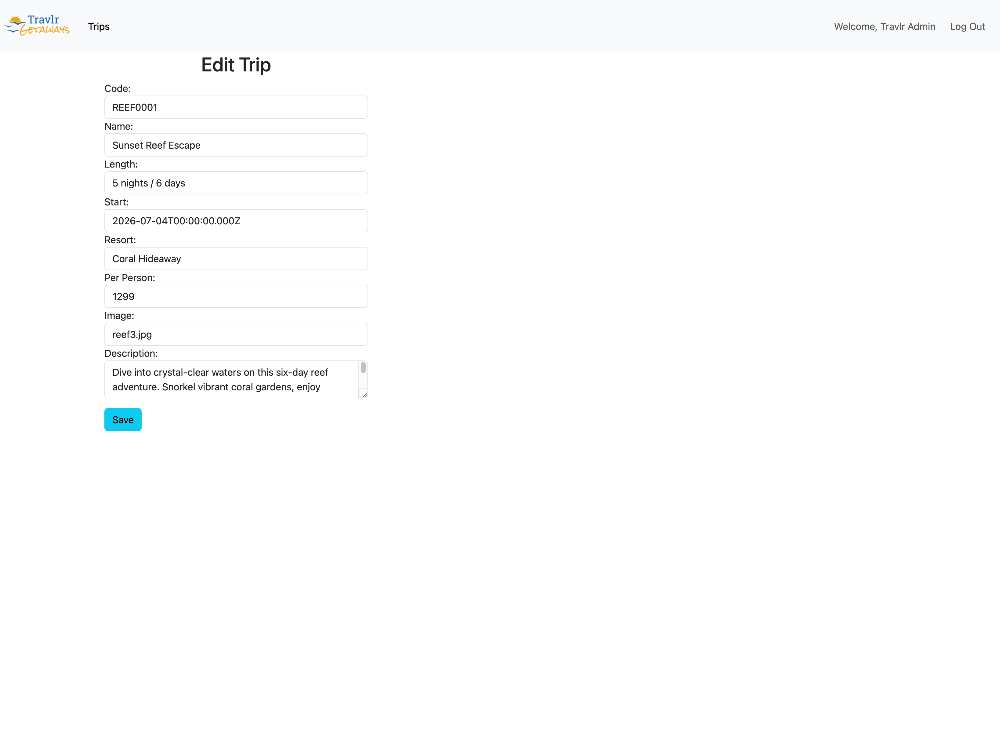

# Travlr Getaways


## CS 465 Project Software Design Document

Version 1.2

---

## Table of Contents

- [Travlr Getaways](#travlr-getaways)
  - [CS 465 Project Software Design Document](#cs-465-project-software-design-document)
  - [Table of Contents](#table-of-contents)
  - [Document Revision History](#document-revision-history)
  - [Executive Summary](#executive-summary)
  - [Design Constraints](#design-constraints)
  - [System Architecture View](#system-architecture-view)
    - [Component Diagram](#component-diagram)
    - [Sequence Diagram](#sequence-diagram)
    - [Class Diagram](#class-diagram)
  - [API Endpoints](#api-endpoints)
  - [The User Interface](#the-user-interface)

---

## Document Revision History

| Version | Date     | Author      | Comments                                                                                                                                                                    |
|---------|----------|-------------|-----------------------------------------------------------------------------------------------------------------------------------------------------------------------------|
| 1.0     | 03/18/26 | Rick Goshen | Completed Executive Summary, Design Constraints, and System Architecture View (Component Diagram) sections for initial client delivery.                                      |
| 1.1     | 04/02/26 | Rick Goshen | Completed System Architecture View (Sequence Diagram, Class Diagram) and Interfaces (API Endpoints) sections.                                                               |
| 1.2     | 04/16/26 | Rick Goshen | Completed The User Interface section with Angular vs. Express structural comparison, SPA functionality overview, and end-to-end testing walkthrough with screenshots.        |

---

## Executive Summary

Travlr Getaways needs a web application that brings together three core capabilities. The first is a customer-facing website where travelers can browse available trip packages and view trip details. The second is a database to store and manage all trip and user data. The third is an administrative application where staff can create, update, and manage trip listings. These three pieces need to work together as a single integrated platform. The system also needs to scale reliably as the business grows, which means the underlying technology choices matter not just for the initial build but for long-term maintenance and expansion as well.

To meet these requirements, the application will be built on the MEAN stack. MEAN is an acronym for its four component technologies: MongoDB (the database), Express (the server framework), Angular (the front-end framework), and Node.js (the runtime environment that allows JavaScript to run on a server). Together, these technologies support the database, server-side logic, and user interface needed for the application. The MEAN stack was selected because all four technologies share JavaScript as their core language. That consistency reduces development complexity, simplifies testing, and makes the system easier to maintain over time. Using the MEAN stack also makes the application easier to support over time because the technologies are widely used and well documented.

The customer-facing website will be built using the Express and Node.js portions of the MEAN stack with a server-side rendering approach. In practice, this means that when a customer visits the site, the server assembles a complete webpage by pulling trip data from the MongoDB database, applying the layout and formatting, and delivering a finished page to the browser. Server-side rendering was chosen for the public site because it supports fast initial page loads, works well across a wide range of devices and browsers, and produces a page structure that is favorable for search engine visibility. Customers will be able to browse available travel packages, view trip details including images and pricing, and explore destinations. None of that requires an account or any special software beyond a standard web browser.

The administrative interface will be built as an Angular single-page application (SPA) to support interactive admin workflows. Unlike the customer-facing site, the SPA loads once in the browser and then handles all navigation and content updates on the client side without reloading the page. Angular provides the rich functionality that makes this possible. That includes dynamic page rendering, reusable interface components, real-time form validation, and organized data management through dedicated service modules. The result is a fast, responsive experience for administrators when they are adding new trip packages, editing existing listings, or managing site content. The SPA communicates with the same Express and Node.js backend that powers the customer site, so both interfaces always draw from the same data in the MongoDB database.

Security is built into the platform from the start. The administrative interface requires authentication before any content changes can be made. When an administrator logs in, the system verifies their credentials and issues a secure token that is checked with every subsequent request involving data modifications. Trip content and business data are protected from unauthorized access, while the customer browsing experience remains open and accessible to the public.

---

## Design Constraints

Building the Travlr Getaways application involves several design constraints that establish boundaries for the project. These constraints come from the MEAN stack platform, the architectural decisions required to support two distinct user interfaces, and the operational requirements of running a web-based application. Each one carries implications for how development will proceed, and understanding them upfront helps set realistic expectations for the project timeline and future growth.

The MEAN stack provides a unified development platform where MongoDB, Express, Angular, and Node.js all operate within the JavaScript ecosystem. That consistency is a major advantage during development. However, it also means the entire application depends on a single technology foundation. Security vulnerabilities, breaking changes in framework updates, or deprecation of key supporting libraries would affect every layer of the system rather than being isolated to one piece. The development team will need to actively manage dependencies and plan for periodic maintenance cycles to keep the platform current and secure throughout its lifecycle.

MongoDB stores data as flexible, document-based records rather than in rigid table structures. This format is a good fit for the Travlr Getaways application because trip data (descriptions, images, pricing, dates, and resort details) maps naturally to it without requiring complex configuration. The tradeoff is that MongoDB does not automatically enforce relationships between different types of records the way a traditional relational database would. The MEAN stack addresses this through Mongoose, an object data modeling layer that defines and enforces data structure rules at the application level. As the application grows to include features like customer accounts or booking history, these rules will need to be expanded carefully to maintain data consistency across a larger and more complex data set.

The application supports two different rendering strategies to serve its two audiences. The customer-facing website uses server-side rendering through Express, where pages are fully assembled on the server before being sent to the browser. The administrative SPA uses client-side rendering through Angular, where the browser handles page updates locally after the initial load. Maintaining both approaches within the MEAN stack increases the amount of code that the development team is responsible for. Any changes to shared data structures or backend services need to be tested against both the server-rendered customer pages and the Angular admin components to make sure behavior stays consistent across both interfaces.

The admin SPA uses RESTful API endpoints built in Express, while the customer-facing site relies on Express server-side rendering against the same backend data source. The API provides a consistent backend interface for data operations needed by the application. Having a shared service layer eliminates duplication and ensures a single source of truth in the MongoDB database. The flipside is that the API becomes a shared dependency, so if an endpoint experiences an issue, both interfaces feel the impact. For that reason, the API layer must be designed with thorough input validation, consistent response formatting, and clear error handling.

The admin SPA uses token-based authentication, where a secure credential is issued at login and validated with each subsequent data-modifying request. This approach keeps the server architecture simple and supports future scaling since the server does not need to track active sessions on its end. The constraint here is token expiration. If a token expires during an active session, the administrator will need to log in again. Future enhancements could introduce automatic token renewal to reduce interruptions during longer administrative work sessions.

The current MEAN stack development environment runs all components (the Express server, the Angular development server, and the MongoDB database) on a single machine. That setup is appropriate for building and testing the application, but it does not reflect how the system will operate in production. Transitioning to a live environment will require additional configuration, including network security settings, environment-specific database connections, and infrastructure to serve both the customer site and admin interface under a unified web address.

---

## System Architecture View

### Component Diagram



> A text version of the component diagram is available: [CS 465 Full Stack Component Diagram Text Version](https://learn.snhu.edu/d2l/lor/viewer/view.d2l?ou=6606&loIdentId=24342)

The component diagram illustrates the overall system architecture of the Travlr Getaways web application. The system is organized into three physical tiers: the Client tier, the Server tier, and the Database tier. Each tier handles a specific set of responsibilities within the MEAN stack architecture, and the connections between them define how data flows through the system. This three-tier separation is a standard pattern in web application design because it keeps concerns isolated, making the system easier to develop, test, and scale independently at each layer.

The Client tier represents everything that runs in the user's browser. It contains four components. The Web Browser is the entry point for all user interaction, displaying content and accepting input from both customers and administrators. The Client Session component manages authentication state on the client side by storing and managing the secure token issued by the server, which is how the system tracks whether an administrator is currently logged in. The Traveler Portfolio component handles the presentation of trip listings, trip details, and related content to the user. In the admin SPA specifically, this is where Angular's component-based architecture drives the dynamic rendering of trip data, forms, and interactive controls. The Graphic Library supports the visual presentation of trip content by supplying shared styling and assets used by the Traveler Portfolio. The Web Browser depends on both Client Session and Traveler Portfolio to deliver the full user experience.

The Server tier contains the backend components built with Express and Node.js. These components handle business logic, data access, and security for the entire application. The Authentication Server processes administrator login requests by verifying credentials against stored records and issuing secure tokens for authenticated sessions. It connects to Client Session across the network boundary, reflecting the login request and token response exchange between the browser and the server. The Server Session component represents request handling and routing within the server tier, not persistent login session storage. Server Session depends on the Traveler Database component, which contains the application logic for querying and modifying trip records through the RESTful API endpoints. Finally, the Mongoose ODM (Object Data Modeling) component sits between the Traveler Database and the physical MongoDB instance. Its job is to translate application-level data requests into database operations and enforce the data structure rules defined in the application's schemas.

The Database tier contains a single component, which is MongoDB. This is the persistent data store for the entire application, holding trip records as document-based entries organized into collections. MongoDB connects to the Mongoose ODM on the Server tier, which manages all read and write operations on its behalf. Because of this separation, the application code never interacts with the database directly. All access flows through the Mongoose layer, which provides a consistent and controlled interface that protects the integrity of the stored data.

There are generally three approaches for distributing processing work between a user's browser and a server, and it is worth understanding all three to see why the approach chosen for Travlr Getaways makes sense. In a thin client approach, the server performs nearly all processing and the browser simply displays the finished result. In a thick client approach, the browser handles most of the application logic and the server primarily stores and retrieves data. The third option is a hybrid, and that is what the Travlr Getaways application uses. The customer-facing website follows the thin client model. Express assembles complete pages on the server using data from MongoDB and delivers them ready to display. The admin SPA follows the thick client model. Angular handles navigation, rendering, and interactive functionality in the browser and only communicates with the Express backend when it needs to read or write data. This hybrid approach works well because the customer site is simpler to serve from the server, while the admin SPA needs a more robust interaction in the browser. Customers get broad accessibility and fast first-page loads. Administrators get a responsive, interactive experience that does not require constant page reloads.

The component diagram shows how the Travlr Getaways application is divided across the client, server, and database tiers. The client tier includes the Traveler Portfolio, Admin SPA, and supporting visual assets that users interact with through a web browser. These client-side elements communicate with the server tier over a network boundary, where Express handles routing, application logic, and responses to incoming requests. Within the server tier, the REST API, authentication logic, and other supporting services coordinate access to application data. Mongoose provides the connection between the server and MongoDB, allowing trip information to be retrieved, updated, and stored consistently. Together, these relationships show how responsibilities are separated across the architecture while still working as one integrated system.

---

### Sequence Diagram



The sequence diagram illustrates how a single user request moves through the Travlr Getaways application from the browser to the database and back. The diagram is organized into three tiers that reflect the system architecture. The Client-Side tier contains the Angular components that run in the browser. The Server-Side tier contains the Express and Node.js backend that processes API requests. The Data-Tier contains MongoDB, where all application data is stored. Each of these tiers is broken down further into the individual components that handle a specific part of the request lifecycle.

The flow begins when a user performs an action in the browser that triggers a route. The Route component on the client side receives that request and redirects it to the Browser/View/Template, which is the visual layer responsible for rendering content to the user. The view then interacts with the Controller, which is the Angular component logic that manages data and coordinates communication with backend services. When the Controller needs data, it calls a service that delegates the actual HTTP communication to the HTTP Client. The HTTP Client sends the request across the network boundary to the Server-Side tier, where it reaches an Express Controller. That server-side Controller processes the incoming request and calls the Controller/Model layer to retrieve or modify data. In practice, this means the Mongoose ODM translates the application-level request into a database operation and forwards it to MongoDB. MongoDB processes the query and returns the results through a callback. From there, the response travels back through each layer in reverse. The Controller/Model returns a JSON response to the Express Controller, which sends it back to the HTTP Client as a resolved promise. The Angular Controller receives the data, assigns it to scope so the view can access it, and the Browser/View/Template renders the updated content for the user.

The Trips workflow is a straightforward example of this pattern. A request to view available travel packages follows the full path described above. The Angular Controller calls the trip data service, which issues a GET request through the HTTP Client to the Express API. The Express Controller retrieves trip records through Mongoose, and MongoDB returns the matching documents. The response flows back to the Angular Controller, which binds the trip data to the view for display. Adding or editing a trip follows the same structural path but uses POST or PUT requests and includes form data in the request body.

The Sign In workflow follows the same tier-to-tier communication, but the server-side processing is different. When an administrator submits login credentials, the Angular Controller passes the email and password to the authentication service, which sends a POST request to the Express backend. The server-side Controller delegates credential verification to the Passport authentication module, which checks the submitted credentials against the stored user record in MongoDB. If the credentials are valid, the server generates a JSON Web Token (JWT) and returns it to the client. The Angular application stores that token locally and attaches it as an authorization header on all subsequent requests that modify data. That token is where the Admin workflow ties into the authentication flow. When an administrator adds a new trip or updates an existing listing, the HTTP Client includes the stored JWT with the request. On the server side, authentication middleware validates the token before the request ever reaches the Express Controller. If the token is missing, expired, or invalid, the server rejects the request with a 401 error. If the token passes validation, the request proceeds through the Controller and Controller/Model layers to MongoDB, and the data modification is carried out. The result is that only authenticated administrators can make changes to trip data, while browsing operations remain open to all users.

---

### Class Diagram



The class diagram illustrates the JavaScript classes that make up the Travlr Getaways web application. These classes define the data structures and operations needed to support trip browsing, booking, and membership management. The diagram organizes them into four functional groupings based on what each class is responsible for. Information classes hold the details for specific travel components. Account classes represent the people and memberships in the system. Booking classes handle the retrieval of reservations. Operational classes coordinate the higher-level workflows that tie everything together.

At the center of the diagram is the Itinerary class, which serves as the main container for a complete travel package. It holds three attributes that describe the package at a summary level, including totalprice, totalmiles, and stopover. The composition relationships connecting Itinerary to the four information classes are significant because they indicate that an Itinerary is built from these parts and owns them. If an Itinerary is removed, its associated components go with it. Those four information classes are CruiseInfo, FlightInfo, HotelInfo, and TripInfo. CruiseInfo stores the cruise name, cabin type, and price. FlightInfo captures the airline name, seat class, and price. HotelInfo contains the hotel name, star rating, location, number of rooms requested, and price. TripInfo holds the starting date, returning date, origin, and destination. Together, these classes give the application a structured way to represent every piece of a travel package without cramming unrelated data into a single class.

The MemberAccount class represents a registered user in the system. It stores the member number, frequent airline, membership status, and member club. MemberAccount connects to Travel_Agent with a one-to-many relationship, meaning a single member account can be associated with multiple booking interactions over time. The TravellerInfo class is simpler. It holds a single attribute for the companion number, which tracks how many additional travelers are included with a booking. TravellerInfo connects to the three booking classes and to Travel_Agent, linking the person making the trip to the actual reservation records.

The Travel_Agent class is the operational core of the diagram. Its methods handle the high-level booking workflows. BookPackage accepts an Itinerary and returns a complete Itinerary. BookFlight, BookHotel, and BookCruise each accept an Itinerary and return the corresponding information class with the booking details filled in. Travel_Agent has a zero-to-many relationship with each of the three booking classes, which reflects the fact that an agent interaction may or may not result in bookings depending on the workflow. The Membership_Admin class operates alongside Travel_Agent and is responsible for managing membership points and validation. Its creditpoints method determines whether points should be applied to an itinerary. The getpoints and validate methods both take a member number and frequent airline as parameters and handle point lookups and membership verification respectively.

The three booking classes round out the diagram. HotelBooking, FlightBooking, and CruiseBooking each contain a single method that accepts TravellerInfo and the relevant information class as parameters and returns the completed booking record. These classes sit between the traveler data and the travel component data, acting as the transaction layer that finalizes a reservation. Their zero-to-many relationships with TravellerInfo reflect that a traveler may have no bookings or many bookings across different trips. The overall structure of the class diagram follows a pattern where data classes define what information the system tracks, booking classes handle the transactional operations, and the Travel_Agent and Membership_Admin classes provide the coordination logic that connects them.

---

## API Endpoints

| **Method** | **Purpose**                   | **URL**               | **Notes**                                                                                                                                                                                                                                                                                                                                                                                                                                                                               |
|------------|-------------------------------|-----------------------|-----------------------------------------------------------------------------------------------------------------------------------------------------------------------------------------------------------------------------------------------------------------------------------------------------------------------------------------------------------------------------------------------------------------------------------------------------------------------------------------|
| **GET**    | Retrieve all trips            | /api/trips            | Returns the full collection of trip records from MongoDB as a JSON array. This endpoint serves both the customer-facing website and the admin SPA, making it the primary read operation for trip data across the application. No authentication is required because trip browsing is open to all users.                                                                                                                                                                                  |
| **GET**    | Retrieve a single trip        | /api/trips/:tripCode  | Returns one trip record filtered by the tripCode parameter in the URL. This endpoint exists separately from the list endpoint because retrieving a single record is more efficient than pulling the full collection when only one trip is needed. The admin SPA uses this endpoint to populate the edit form with the current values for a selected trip. No authentication is required.                                                                                                   |
| **POST**   | Add a new trip                | /api/trips            | Creates a new trip record in MongoDB using the data submitted in the request body. The request body must include all required trip fields (code, name, length, start, resort, perPerson, image, and description). This endpoint requires a valid JSON Web Token in the authorization header. If the token is missing or invalid, the server rejects the request with a 401 status.                                                                                                        |
| **PUT**    | Update an existing trip       | /api/trips/:tripCode  | Updates the trip record matching the tripCode parameter using the Mongoose findOneAndUpdate method. The request body contains the updated field values. Like the POST endpoint, this route requires a valid JWT in the authorization header. A separate update endpoint is necessary because adding and modifying records are fundamentally different database operations with different validation and error handling requirements.                                                         |
| **POST**   | Register a new user           | /api/register         | Creates a new user record in MongoDB with the submitted name, email, and password. The password is hashed and salted before storage rather than saved in plain text. On successful registration, the server generates and returns a JWT so the new user is immediately authenticated without needing a separate login step.                                                                                                                                                               |
| **POST**   | Authenticate an existing user | /api/login            | Validates the submitted email and password against the stored user record using the Passport authentication module with a local strategy. If the credentials match, the server generates and returns a JWT. If the credentials are invalid or incomplete, the server returns an appropriate error status. This endpoint is the entry point for all authenticated admin sessions.                                                                                                           |

---

## The User Interface

### Angular Project Structure vs. Express Project Structure

The Travlr Getaways application uses two distinct front-end structures that reflect the different rendering strategies chosen for each audience. Understanding how these structures differ helps explain why the Angular SPA and the Express customer site behave so differently even though they share the same backend API.

The Express customer-facing application follows a Model-View-Controller (MVC) pattern organized around server-side rendering. The project structure reflects this: controllers live in `app-server/controllers/`, route definitions in `app-server/routes/`, and Handlebars (HBS) templates in `app-server/views/`. When a customer requests a page, the server controller fetches data from the API, passes it to the matching HBS template, and delivers a fully-rendered HTML page to the browser. Every navigation action triggers a complete round trip to the server — a new HTTP request, a new page rendered on the server, and a full page reload in the browser. This model is straightforward and works well for a public-facing site where search engine visibility and broad device compatibility matter most.

The Angular admin SPA is structured very differently. It lives entirely in `app-admin/src/app/` and is organized around components, services, models, and routing — all of which run in the browser. Each piece of the UI is an Angular component (for example, `trip-listing`, `trip-card`, `add-trip`, `edit-trip`, `login`, and `navbar`), each with its own TypeScript class, HTML template, and CSS file. Services in `app-admin/src/app/services/` handle all HTTP communication with the Express API — the `TripDataService` manages trip CRUD operations and the `AuthenticationService` manages JWT storage and validation. A JWT interceptor in `app-admin/src/app/utils/jwt.interceptor.ts` automatically attaches the stored token to every outgoing HTTP request that needs authentication, so components never have to manage that detail themselves.

The most significant structural difference is where rendering happens. In Express, the server owns rendering; in Angular, the browser owns it. Once the Angular SPA loads, navigating between the trip list, the add-trip form, and the edit-trip form never reloads the page — the Angular router handles those transitions entirely within the browser. Only actual data operations (loading trips, saving a new trip, updating an existing one) cross the network to the Express API. This architecture gives the admin interface a faster, more fluid feel compared to the full-page reloads of the customer site.

### SPA Rich Functionality

The Angular SPA provides several capabilities that would be difficult or inefficient to replicate in the server-rendered customer site:

**Client-side routing.** The Angular router maps URL paths (`/`, `/login`, `/add-trip`, `/edit-trip`) to components and handles transitions without server involvement. The browser URL updates and the back button works, but no page reload occurs.

**Reactive forms with real-time validation.** Both the add-trip and edit-trip forms use Angular's `ReactiveFormsModule`. Required field validation runs in the browser as the administrator fills out the form. If validation fails on submit, error messages appear inline next to each field without any server round trip.

**JWT interceptor.** The `JwtInterceptor` automatically reads the stored token from `localStorage` and injects it as a `Bearer` authorization header on every HTTP request. This means the add-trip and edit-trip components do not need any authentication logic — the interceptor handles it transparently.

**Conditional rendering.** The navbar and trip cards use Angular's `*ngIf` directive to show or hide elements based on authentication state. When no administrator is logged in, the Log In link is visible and Edit Trip buttons are hidden. Once logged in, the greeting, Log Out link, Add Trip button, and Edit Trip buttons all appear without a page reload.

**Component reusability.** The `TripCardComponent` is a self-contained unit that renders a single trip card. The `TripListingComponent` renders all trips by iterating over the API response and instantiating one `TripCardComponent` per record. Adding a new trip automatically re-renders the list because the component fetches fresh data from the API after a successful save.

### Testing the SPA with the API

The following walkthrough demonstrates that the SPA correctly exchanges data with the Express API using both GET and PUT (and POST) operations. Each step is documented with a screenshot.

#### Step 1 — Seed the database and start the servers

Before testing, the database must be seeded and both servers must be running.

```bash
# From the project root
npm run seed        # populates MongoDB with initial trip data
npm start           # starts the Express API + customer site on port 3000

# In a second terminal
cd app-admin
ng serve            # starts the Angular SPA on port 4200
```

#### Step 2 — View the trip list (GET /api/trips) — unauthenticated

Opening `http://localhost:4200` loads the SPA and immediately issues `GET /api/trips` to retrieve all trips. The results are displayed as cards. No login is required to view trips.


*Figure 1: The admin SPA landing page showing all trips retrieved from `GET /api/trips`. The Log In link is visible in the navbar; no Edit Trip buttons are shown.*

#### Step 3 — Log in (POST /api/login)

Clicking **Log In** in the navbar navigates to the login form. The administrator enters their credentials and clicks **Sign In!**, which triggers `POST /api/login` via `TripDataService.login()`. On success, the API returns a JWT which `AuthenticationService` stores in `localStorage`. The Angular router then navigates back to the trip list.


*Figure 2: The admin login form. Email and password fields are provided. Submitting calls `POST /api/login`.*



*Figure 3: The trip list after successful login. The navbar now shows "Welcome, Travlr Admin" and a Log Out link. The Add Trip button and Edit Trip buttons are visible.*

#### Step 4 — Add a new trip (POST /api/trips)

Clicking **Add Trip** navigates to the add-trip form. The administrator fills in all required fields — code, name, length, start date, resort, per person price, image filename, and description — then clicks **Save**. The `TripDataService.addTrip()` method issues `POST /api/trips` with the JWT attached by the interceptor. On success, the API creates the record in MongoDB and the SPA navigates back to the trip list, which re-fetches from `GET /api/trips` and displays the new entry.


*Figure 4: The Add Trip form before data entry. All fields are empty and the Save button is present with proper spacing.*


*Figure 5: The Add Trip form populated with data for "Sunset Reef Escape". The image filename `reef3.jpg` references an existing asset.*


*Figure 6: The trip list after saving. "Sunset Reef Escape" now appears as the fourth card, confirming that `POST /api/trips` created the record in MongoDB and `GET /api/trips` returned it.*

#### Step 5 — Edit an existing trip (GET /api/trips/:tripCode + PUT /api/trips/:tripCode)

Clicking **Edit Trip** on the "Sunset Reef Escape" card navigates to the edit-trip form. The SPA calls `GET /api/trips/REEF0001` to retrieve the current record and pre-populates the form fields. The administrator updates the per person price from $1,299 to $1,499 and clicks **Save**. The `TripDataService.updateTrip()` method issues `PUT /api/trips/REEF0001` with the updated data and the JWT. On success, the API updates the record in MongoDB using `findOneAndUpdate` and the SPA navigates back to the refreshed trip list.



*Figure 7: The Edit Trip form pre-populated via `GET /api/trips/REEF0001`. All fields reflect the values stored in MongoDB.*


*Figure 8: The Edit Trip form with the per person price changed from $1,299 to $1,499, ready to submit via `PUT /api/trips/REEF0001`.*


*Figure 9: The trip list after saving the edit. "Sunset Reef Escape" now shows $1,499.00 per person, confirming that `PUT /api/trips/REEF0001` persisted the change in MongoDB.*

### Summary

The testing walkthrough above demonstrates the complete data cycle: seeding MongoDB, retrieving all trips via `GET /api/trips`, authenticating via `POST /api/login`, creating a new trip via `POST /api/trips`, reading a single trip via `GET /api/trips/:tripCode`, and updating it via `PUT /api/trips/:tripCode`. At each step the SPA reflects the current state of the database without a page reload, confirming that the Angular application and the Express API are correctly integrated end-to-end.
